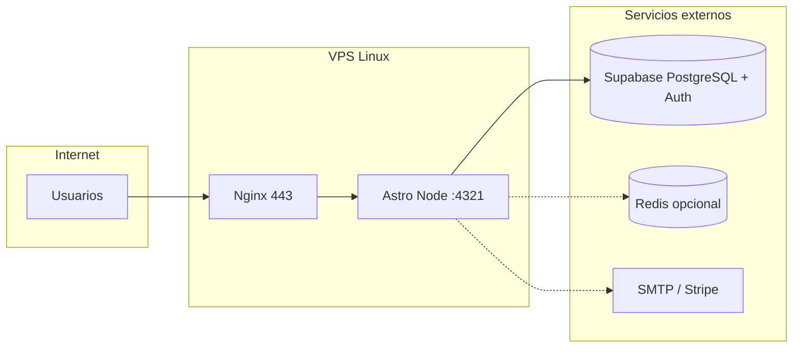

# Despliegue en VPS Linux con dominio propio

Guía para publicar **DentalFlow / Dentista+** en un servidor Linux (Ubuntu/Debian) con **dominio**, **HTTPS** y **Supabase** como base de datos. El repositorio está optimizado para Vercel; en VPS se usa el adapter **Node standalone** incluido en `deploy/vps/`.

## Arquitectura recomendada



| Componente | Dónde corre | Notas |
|------------|-------------|--------|
| Frontend + APIs | VPS (Node 20+) | `src/pages/api/*` requieren SSR |
| Base de datos | Supabase (cloud) | No instales Postgres en el VPS salvo que migres todo |
| Redis | Opcional (VPS o Upstash) | Sin `REDIS_URL` → cache en memoria |
| Correo / WhatsApp | Proveedor externo | Ver `docs/EMAIL.md` |

## Requisitos

### VPS

| Recurso | Mínimo | Recomendado |
|---------|--------|-------------|
| CPU | 1 vCPU | 2 vCPU |
| RAM | 2 GB | 4 GB |
| Disco | 20 GB SSD | 40 GB SSD |
| SO | Ubuntu 22.04/24.04 LTS o Debian 12 | Ubuntu 24.04 LTS |

### Dominio

1. Registra un dominio (ej. `tudominio.com`).
2. En el DNS del registrador crea un registro **A** (o **AAAA** si usas IPv6):

| Tipo | Nombre | Valor | TTL |
|------|--------|-------|-----|
| A | `app` | IP pública del VPS | 300 |

La app quedará en `https://app.tudominio.com`. Puedes usar `@` en lugar de `app` si quieres el dominio raíz.

3. Espera propagación (5–60 min). Comprueba:

```bash
dig +short app.tudominio.com
```

### Software en el VPS

- Node.js **≥ 20.11** (LTS)
- npm
- nginx
- certbot (`python3-certbot-nginx`)
- git
- Opcional: Redis 7, `ufw`

---

## 1. Preparar Supabase

1. Crea un proyecto en [supabase.com](https://supabase.com).
2. Aplica migraciones en orden — ver **`docs/SUPABASE_APPLY.md`** (mínimo PRO: `0001` → `0003` → `0006` → `0008` … hasta la última en `supabase/migrations/`).
3. Desde tu máquina de desarrollo (con `.env` y `DATABASE_URL`):

```bash
node --env-file=.env scripts/apply-sql-migration.mjs supabase/migrations/0035_organizations_staff_access.sql
```

   O con Supabase CLI enlazado: `supabase db push`.

4. En **Authentication → URL configuration** añade:
   - Site URL: `https://app.tudominio.com`
   - Redirect URLs: `https://app.tudominio.com/**`

5. Copia del panel **Settings → API**:
   - `PUBLIC_SUPABASE_URL`
   - `PUBLIC_SUPABASE_ANON_KEY`
   - `SUPABASE_SERVICE_ROLE_KEY` (solo servidor, nunca en el navegador)

---

## 2. Preparar el VPS (usuario y firewall)

Conéctate por SSH:

```bash
ssh root@IP_DEL_VPS
```

### Usuario de despliegue

```bash
adduser deploy
usermod -aG sudo deploy
su - deploy
```

### Firewall (UFW)

```bash
sudo ufw allow OpenSSH
sudo ufw allow 'Nginx Full'
sudo ufw enable
sudo ufw status
```

### Node.js 20 LTS (Ubuntu)

```bash
curl -fsSL https://deb.nodesource.com/setup_20.x | sudo -E bash -
sudo apt-get install -y nodejs git nginx certbot python3-certbot-nginx
node -v   # debe ser >= v20.11.0
```

---

## 3. Clonar el proyecto

```bash
sudo mkdir -p /var/www/dentista
sudo chown deploy:deploy /var/www/dentista
cd /var/www/dentista

git clone https://github.com/D1abloo/dentista.git .
npm ci
```

Instala el adapter Node (necesario solo para build VPS):

```bash
npm install @astrojs/node
```

---

## 4. Variables de entorno

```bash
cp .env.example .env
nano .env
```

Valores **obligatorios** en producción:

```env
PUBLIC_DEMO_MODE=false
PUBLIC_APP_URL=https://app.tudominio.com
AUTH_SESSION_SECRET=<openssl rand -hex 32>

PUBLIC_SUPABASE_URL=https://xxxxx.supabase.co
PUBLIC_SUPABASE_ANON_KEY=<anon-key>
SUPABASE_SERVICE_ROLE_KEY=<service-role-key>

SUPER_ADMIN_EMAIL=admin@tudominio.com
SUPER_ADMIN_PASSWORD=<password-fuerte>
CLINIC_DEFAULT_PASSWORD=<password-altas-clinica>
```

Generar secreto de sesión:

```bash
openssl rand -hex 32
```

Opcionales según funcionalidad — ver `.env.example` y `docs/PRODUCTION.md`:

- `REDIS_URL` — cache distribuida
- `STRIPE_SECRET_KEY` / `STRIPE_WEBHOOK_SECRET` — pagos
- `EMAIL_PROVIDER`, `SMTP_*` o `RESEND_API_KEY` — correos
- `ADMIN_PANEL_ENTRY_SLUG` / `ADMIN_PANEL_ENTRY_SECRET` — ocultar URL del panel

Protege el fichero:

```bash
chmod 600 .env
```

---

## 5. Build para VPS (Node standalone)

El `astro.config.mjs` por defecto usa **Vercel**. En VPS usa la config dedicada:

```bash
cd /var/www/dentista
npm run build:vps
```

Esto genera `dist/server/entry.mjs` y assets estáticos. Comprueba localmente antes de nginx:

```bash
HOST=127.0.0.1 PORT=4321 NODE_ENV=production node dist/server/entry.mjs
curl -I http://127.0.0.1:4321/
# Ctrl+C para parar
```

Scripts del repo:

| Comando | Uso |
|---------|-----|
| `npm run build:vps` | Compila con `deploy/vps/astro.config.mjs` |
| `npm run start:vps` | Arranca el servidor Node en producción |

---

## 6. Servicio systemd (arranque automático)

Copia la plantilla y ajústala:

```bash
sudo cp deploy/vps/dentalflow.service /etc/systemd/system/dentalflow.service
sudo nano /etc/systemd/system/dentalflow.service
# Revisa User=, WorkingDirectory= y ruta de node si usas nvm
```

Activa el servicio:

```bash
sudo systemctl daemon-reload
sudo systemctl enable dentalflow
sudo systemctl start dentalflow
sudo systemctl status dentalflow
journalctl -u dentalflow -f
```

Tras cada despliegue:

```bash
cd /var/www/dentista
git pull
npm ci
npm run build:vps
sudo systemctl restart dentalflow
```

---

## 7. Nginx como reverse proxy

```bash
sudo cp deploy/vps/nginx-dentalflow.conf /etc/nginx/sites-available/dentalflow
sudo nano /etc/nginx/sites-available/dentalflow
# Cambia app.tudominio.com por tu dominio
sudo ln -sf /etc/nginx/sites-available/dentalflow /etc/nginx/sites-enabled/
sudo nginx -t
sudo systemctl reload nginx
```

---

## 8. HTTPS con Let's Encrypt

```bash
sudo mkdir -p /var/www/certbot
sudo certbot --nginx -d app.tudominio.com
```

Renovación automática (suele instalarse un timer):

```bash
sudo certbot renew --dry-run
```

Confirma en el navegador: `https://app.tudominio.com` y que las cookies de sesión funcionan (login admin/paciente).

---

## 9. Datos iniciales (opcional)

Con `.env` configurado en el VPS:

```bash
# Clínica Nova + super admin + pacientes demo
npm run seed:clinic

# Red de 19 clínicas demo (requiere migración 0035)
npm run seed:clinics-network
```

Inventario de cuentas: **`docs/DEMO_USUARIOS.txt`**.

Comprobaciones:

```bash
npm run check
npm run smoke
```

Rutas a probar manualmente:

- `https://app.tudominio.com/`
- `https://app.tudominio.com/platform/login`
- `https://app.tudominio.com/login/admin`
- `https://app.tudominio.com/admin`
- `https://app.tudominio.com/paciente`

---

## 10. Integraciones en producción

### Stripe

En el dashboard de Stripe, webhook:

- URL: `https://app.tudominio.com/api/billing/stripe-webhook`
- Eventos: `checkout.session.completed` (y los que uses)
- Secreto → `STRIPE_WEBHOOK_SECRET` en `.env`

### Correo

Configura SMTP o Resend — **`docs/EMAIL.md`**. Sin proveedor, el sistema usa modo mock (no envía correos reales).

### Redis (opcional)

```bash
sudo apt install redis-server
```

En `.env`:

```env
REDIS_URL=redis://127.0.0.1:6379
```

---

## 11. Actualizar la aplicación

Flujo recomendado en el VPS:

```bash
cd /var/www/dentista
git fetch origin
git checkout main
git pull origin main
npm ci
npm run build:vps
sudo systemctl restart dentalflow
```

Si hay migraciones SQL nuevas, aplícalas en Supabase antes o después del deploy (ver `docs/SUPABASE_APPLY.md`).

En desarrollo, antes de subir código:

```bash
npm run check
npm run smoke
npm run build:vps   # opcional, validar build Node
```

---

## 12. Checklist de producción

- [ ] `PUBLIC_DEMO_MODE=false`
- [ ] `AUTH_SESSION_SECRET` único y largo (32+ bytes)
- [ ] `PUBLIC_APP_URL` coincide con el dominio HTTPS real
- [ ] Migraciones Supabase aplicadas
- [ ] Redirect URLs de Supabase Auth actualizadas
- [ ] HTTPS activo (certbot)
- [ ] Service role **solo** en `.env` del servidor
- [ ] `.env` con permisos `600`, fuera de git
- [ ] Firewall: solo 22, 80, 443
- [ ] Backups activados en Supabase
- [ ] Webhook Stripe apuntando al dominio VPS
- [ ] Prueba login admin, paciente y super admin

---

## 13. Solución de problemas

| Síntoma | Causa habitual | Acción |
|---------|----------------|--------|
| 502 Bad Gateway | App Node caída | `systemctl status dentalflow`, `journalctl -u dentalflow -n 50` |
| Login no persiste | `AUTH_SESSION_SECRET` distinto entre reinicios o `PUBLIC_APP_URL` incorrecta | Revisa `.env`, cookies `Secure` con HTTPS |
| APIs 500 | Supabase mal configurado | Revisa keys y RLS; logs del servicio |
| Build falla en VPS | RAM insuficiente | Aumenta swap o compila en CI y sube `dist/` |
| `Cannot find module` tras pull | Dependencias desactualizadas | `npm ci` |
| Dominio no resuelve | DNS | `dig app.tudominio.com` |

Logs útiles:

```bash
journalctl -u dentalflow -f
sudo tail -f /var/log/nginx/error.log
```

---

## 14. Vercel vs VPS

| | Vercel | VPS Linux |
|---|--------|-----------|
| Config Astro | `astro.config.mjs` + adapter Vercel | `deploy/vps/astro.config.mjs` + `@astrojs/node` |
| Build | `npm run vercel-build` | `npm run build:vps` |
| HTTPS / dominio | Panel Vercel | nginx + certbot |
| Escalado | Automático | Manual (más VPS, balanceador) |

Puedes mantener **staging en Vercel** y **producción en VPS**, o todo en VPS.

---

## Referencias

- Variables y modo producción: `docs/PRODUCTION.md`
- Migraciones SQL: `docs/SUPABASE_APPLY.md`
- Usuarios demo: `docs/DEMO_USUARIOS.txt`
- Despliegue Vercel: `docs/DEPLOYMENT.md`
- Plantillas: `deploy/vps/nginx-dentalflow.conf`, `deploy/vps/dentalflow.service`
